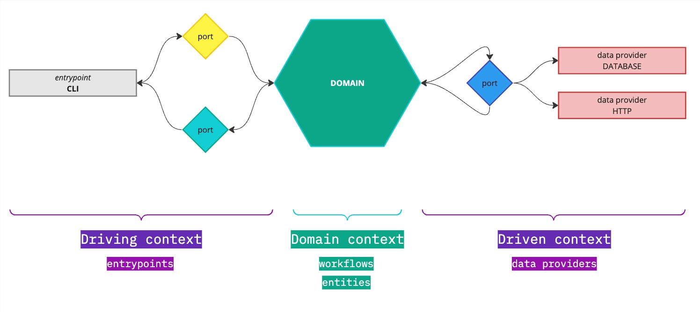
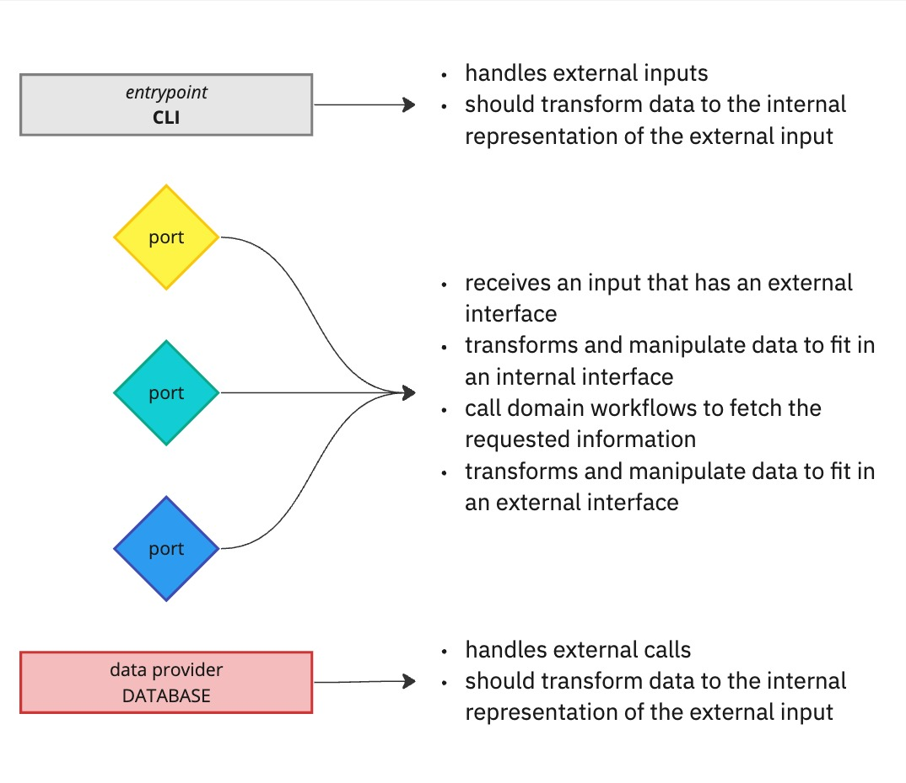

# ewbscp

## CLI Usage
First, make sure you have `make` installed on your system. Then:

```
$ make help

Commands:
  make build - Mix project build
  make zip <cmd> <args> - Runs commands based on this:
   >> directory_size <path> -- [<flags>]
      |> --allow-empty - Includes empty directories
   >> fetch_wikipedia_page <uri>
  make help - Display this message
```

## Architecture



## Concepts & Responsibilities



## Folder structure

```
.
├── /entrypoints/
│   └── /cli/
│       └── cli_input.ex
├── /port/
│   └── /workflow/
│       └── /articles/
│           ├── /external/
│           │   └── cli_to_article.ex
│           ├── /internal/
│           │   └── title_to_article.ex
│           └── /models/
│               └── article_input.ex
├── /domain/
│   ├── /workflow/
│   │   └── /articles/
│   │       ├── orchestrator.ex
│   │       ├── fetch_main_page.ex
│   │       └── fetch_references.ex
│   └── /entities/
│       └── /article/
│           ├── article.ex
│           └── reference.ex
└── /clients/
    └── /article/
        └── article_client.ex
```

### Example call flow from CLI

```
user
  ↓
cli_input.ex         | handles the action inputted
  ↓
cli_to_article.ex    | handles the transformation between external and internal
  ↓
orchestrator.ex      | handles external calls to return a domain entity
  ↓
title_to_article.ex  | handles how to fetch an external content and return to domain as an entity
  ↓
article_client.ex    | handles http calls
  |
  ↑
user (response)
```

This representations assumes that the user receives the result from
cli_input.ex (entrypoint), but assuming that is a black box. Then,
cli_input.ex depends on the cli_to_article.ex response, and so on.
